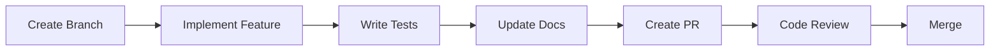

# Contributing to petstore-ui

Welcome to petstore-ui! This project is designed for AI-assisted development with GitHub Copilot. This guide covers both traditional and AI-assisted contribution workflows.

## 🤖 AI-Assisted Development Overview

This project embraces AI-assisted development as a core part of our workflow. We've established patterns and conventions that work well with GitHub Copilot and other AI coding assistants.

### Prerequisites

1. **Read Documentation**: Start with [copilot-instructions.md](copilot-instructions.md)
2. **VS Code Setup**: Use our recommended extensions and settings
3. **GitHub Copilot**: Ensure Copilot is enabled and configured
4. **Environment**: Bun installed (Node.js as fallback)

## 🚀 Quick Start

```bash
# 1. Fork and clone the repository
git clone https://github.com/your-username/petstore-ui.git
cd petstore-ui

# 2. Install dependencies
bun install  # or npm install

# 3. Start development environment  
bun run storybook  # Interactive component development

# 4. Run tests
bun run test

# 5. Validate code quality
bun run lint && bun run type-check
```

## 🏗️ Development Workflows

### Traditional Contribution Workflow



### AI-Assisted Contribution Workflow


## 🤖 AI-Assisted Pull Requests

### PR Title Format
```
feat(ai): Add SearchBox molecule component via Copilot assistance
fix(ai): Improve Button accessibility with AI suggestions  
docs(ai): Update component documentation using AI generation
```

### PR Description Template

When creating a pull request with AI assistance, use this template:

```markdown
## Description
Brief description of changes made.

## AI Assistance Details
- **AI Tool**: GitHub Copilot / ChatGPT / Claude
- **Assistance Level**: [Full Generation / Partial Assistance / Review Only]
- **Human Review**: [What aspects were manually reviewed/modified]

## Generated Code Components
- [ ] React Components
- [ ] TypeScript Interfaces  
- [ ] Unit Tests
- [ ] Storybook Stories
- [ ] Documentation

## Validation Checklist
- [ ] TypeScript compilation passes
- [ ] ESLint rules followed
- [ ] Unit tests written and passing
- [ ] Storybook story created
- [ ] Accessibility tested
- [ ] Design tokens used consistently
- [ ] Performance considerations addressed

## AI Prompts Used
<details>
<summary>Show AI prompts for transparency</summary>

```
Example prompts used to generate this code:
1. "Create a SearchBox molecule component that combines Input and Button atoms..."
2. "Add unit tests for SearchBox with error handling scenarios..."
```
</details>

## Human Review Notes
- Manual adjustments made to [specific areas]
- Business logic validation for [specific functions] 
- Accessibility improvements beyond AI suggestions
```

## 🧪 Testing Requirements

### For AI-Generated Code

All AI-generated code must meet these requirements:

**Unit Tests** (Required):
```typescript
// ✅ Test component rendering
it('renders with correct props', () => {
  render(<Component prop="value" />);
  expect(screen.getByRole('button')).toBeInTheDocument();
});

// ✅ Test user interactions
it('calls handler on click', () => {
  const handler = jest.fn();
  render(<Component onClick={handler} />);
  fireEvent.click(screen.getByRole('button'));
  expect(handler).toHaveBeenCalled();
});

// ✅ Test accessibility
it('has proper ARIA attributes', () => {
  render(<Component />);
  expect(screen.getByRole('button')).toHaveAttribute('aria-label');
});
```

**Integration Tests** (For API components):
```typescript
// ✅ Test API error handling
it('handles API errors gracefully', async () => {
  fetch.mockRejectOnce(new Error('Network error'));
  render(<PetList />);
  await waitFor(() => {
    expect(screen.getByText('Error loading pets')).toBeInTheDocument();
  });
});
```

**Accessibility Tests**:
```typescript
// ✅ Test keyboard navigation
it('supports keyboard navigation', () => {
  render(<Component />);
  const element = screen.getByRole('button');
  fireEvent.keyDown(element, { key: 'Enter' });
  expect(element).toHaveFocus();
});
```

### Test Coverage Requirements
- **Minimum Coverage**: 80% for all new components
- **Functions**: All public methods must be tested
- **Edge Cases**: Error states, loading states, empty states
- **Accessibility**: Screen reader and keyboard navigation

## 📋 Code Review Guidelines

### For Reviewers of AI-Generated Code

**Primary Focus Areas**:

1. **Business Logic Validation** 🧠
   - Verify AI understood requirements correctly
   - Check edge cases and error scenarios
   - Validate integration points

2. **Architecture Alignment** 🏗️
   - Ensure atomic design principles followed
   - Verify design token usage
   - Check component composition patterns

3. **Accessibility Standards** ♿
   - ARIA attributes present and correct
   - Semantic HTML structure
   - Keyboard navigation support
   - Color contrast compliance

4. **Performance Implications** ⚡
   - No unnecessary re-renders
   - Optimized bundle size impact
   - Efficient state management

5. **Security Considerations** 🔒
   - Input sanitization
   - XSS prevention
   - Safe API integrations

**AI-Generated Code Review Checklist**:

```markdown
## Technical Review
- [ ] TypeScript types are accurate and complete
- [ ] ESLint rules pass without overrides
- [ ] Performance impact is acceptable
- [ ] No security vulnerabilities introduced
- [ ] Error handling is comprehensive

## Design System Compliance
- [ ] Uses design tokens consistently
- [ ] Follows atomic design principles
- [ ] Maintains visual consistency  
- [ ] Responsive design implemented

## Accessibility 
- [ ] ARIA attributes are correct
- [ ] Keyboard navigation works
- [ ] Screen reader friendly
- [ ] Color contrast meets standards
- [ ] Focus management is proper

## Testing Quality
- [ ] Unit test coverage ≥ 80%
- [ ] Edge cases are covered
- [ ] Integration tests for API code
- [ ] Accessibility tests included
- [ ] Performance tests if needed

## Documentation
- [ ] JSDoc comments are helpful
- [ ] Storybook story is comprehensive
- [ ] Usage examples are clear
- [ ] Props are well documented
```

### Feedback Guidelines

**Constructive AI Code Review**:

```markdown
// ✅ Good feedback
"The AI-generated component looks good! Consider adding error boundaries for the API calls in PetList. The accessibility attributes are comprehensive. Would you manually verify the keyboard navigation behavior?"

// ✅ Specific suggestions
"In the SearchBox component, the AI chose a good pattern. Could you add a debounce mechanism for the search input? Also, verify the ARIA live region announcements work as expected."

// ❌ Avoid dismissive feedback
"This looks like AI-generated code, rewrite it manually"
```

## 🎯 Component Development Guidelines

### Creating New Components

1. **Plan the Component**:
   ```typescript
   // Define requirements clearly for AI assistance
   interface RequirementSpec {
     componentType: 'atom' | 'molecule' | 'organism';
     functionality: string[];
     props: Record<string, string>;
     variants: string[];
     accessibility: string[];
   }
   ```

2. **Use AI-Friendly Prompts**:
   ```
   "Create a [ComponentType] [ComponentName] component that [specific functionality]. Include TypeScript interfaces, error handling, accessibility attributes, unit tests, and Storybook story. Use design tokens from theme.ts and follow atomic design principles."
   ```

3. **Review and Refine**:
   - Verify business logic accuracy
   - Test accessibility manually
   - Check performance implications
   - Validate design system compliance

4. **Create Comprehensive Tests**:
   - Component rendering and props
   - User interaction scenarios
   - Error and edge cases
   - Accessibility compliance

5. **Document Thoroughly**:
   - JSDoc comments for all props
   - Storybook story with examples
   - Usage guidelines in README

### AI Prompt Engineering Best Practices

**Effective Component Prompts**:

```typescript
// ✅ Specific and detailed
"Create a PetCard molecule component that displays pet information (name, breed, age, image). Include props for pet data object, onClick handler, and loading state. Add hover effects, loading skeleton, error state handling, proper TypeScript interfaces, accessibility attributes (ARIA labels), and unit tests covering all states."

// ✅ Include context
"Create a SearchBox molecule component for the petstore application that combines Input and Button atoms from our design system. It should accept placeholder, onSearch callback, disabled state, and loading state. Use design tokens from theme.ts, include debounced search functionality, proper error handling, comprehensive unit tests, and Storybook story with interactive controls."

// ❌ Vague and unclear  
"Make a search thing for pets"
```

**Story Generation Prompts**:

```typescript
"Create a comprehensive Storybook story for [ComponentName] that includes:
- Default story with common props
- All variants showcase
- Interactive controls for all props
- Edge cases (loading, error, empty states)
- Accessibility testing tools
- Performance monitoring
- MDX documentation with usage examples"
```

## 🔄 Development Process

### Branch Naming Convention

```bash
# Feature branches
feature/ai-searchbox-component
feature/copilot-pet-card-molecule

# Bug fixes
fix/ai-button-accessibility
fix/copilot-api-error-handling

# AI-assisted refactoring
refactor/ai-design-tokens-update
refactor/copilot-component-optimization
```

### Commit Message Format

```bash
# For AI-assisted commits
git commit -m "feat(ai): add SearchBox molecule with Copilot assistance

- Generated component structure and TypeScript interfaces
- Added comprehensive unit tests and accessibility features
- Created Storybook story with interactive controls
- Manually reviewed business logic and edge cases

Co-authored-by: GitHub Copilot <github-copilot@github.com>"
```

### Pre-Commit Checklist

Before committing AI-generated code:

- [ ] Run `bun run lint` (all rules pass)
- [ ] Run `bun run type-check` (no TypeScript errors)
- [ ] Run `bun run test` (all tests pass, coverage ≥ 80%)
- [ ] Run `bun run storybook` (story renders correctly)
- [ ] Manual accessibility testing (keyboard, screen reader)
- [ ] Performance validation (no unnecessary re-renders)
- [ ] Design system compliance (uses tokens consistently)

## 🚀 Release Process

### AI-Assisted Version Bumps

When releasing versions that include AI-generated code:

1. **Changelog Generation**:
   ```bash
   # AI can help generate changelog entries
   git log --oneline --grep="feat(ai)" --since="last-release"
   ```

2. **Documentation Updates**:
   - Update component README files
   - Regenerate Storybook documentation  
   - Update API documentation

3. **Quality Assurance**:
   - Full test suite validation
   - Cross-browser testing
   - Accessibility audit
   - Performance benchmarking

## 🎓 Learning Resources

### AI-Assisted Development

- [GitHub Copilot Documentation](https://docs.github.com/copilot)
- [Cursor AI IDE](https://cursor.sh/) - Alternative AI coding environment
- [v0 by Vercel](https://v0.dev/) - AI component generation
- [Bolt.new](https://bolt.new/) - AI full-stack development

### Component Development

- [Atomic Design Methodology](https://bradfrost.com/blog/post/atomic-web-design/)
- [Storybook Best Practices](https://storybook.js.org/docs/react/writing-docs/introduction)
- [React Testing Library](https://testing-library.com/docs/react-testing-library/intro/)
- [Web Accessibility Guidelines](https://web.dev/accessibility/)

## 🆘 Troubleshooting

### Common AI Code Issues

**TypeScript Errors**:
```bash
# AI sometimes generates invalid types
bun run type-check
# Fix: Review generated interfaces and refine
```

**ESLint Violations**:
```bash
# AI might not follow all style rules
bun run lint --fix
# Manual review required for complex violations
```

**Test Failures**:
```bash
# AI tests might miss edge cases
bun run test --verbose
# Add additional test cases manually
```

**Accessibility Issues**:
```bash
# AI might miss accessibility nuances
npm run test:a11y  # Future: automated accessibility testing
# Manual testing with screen readers required
```

### Getting Help

1. **Check Documentation**: [copilot-instructions.md](copilot-instructions.md)
2. **Review Examples**: Look at existing components in `/src/components/`
3. **Ask in Discussions**: GitHub Discussions for AI-assisted development questions
4. **Open Issues**: For bugs in AI-generated code or tooling problems

## 📞 Contact

For questions about AI-assisted development workflows:

- 💬 **GitHub Discussions**: General questions and best practices
- 🐛 **GitHub Issues**: Bug reports and feature requests
- 📧 **Email**: For sensitive security issues

---

## Summary

This project embraces AI as a development partner while maintaining high code quality standards. Contributors should leverage AI assistance for rapid development while ensuring human oversight for business logic, accessibility, and performance considerations.

Happy coding with AI! 🤖✨