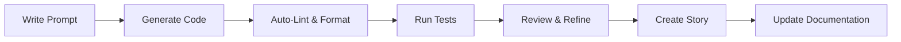

# petstore-ui

A Storybook component library with static website for the Petstore application. This monorepo contains reusable UI components, design tokens, stories, and documentation.

## 🚀 Quick Start

```bash
# Install dependencies with Bun (recommended)
bun install

# Or with Node.js (fallback)
npm install

# Start Storybook development server
bun run storybook

# Build static website
bun run build

# Run tests
bun run test
```

## 🏗️ Project Structure

```
petstore-ui/
├── src/
│   ├── components/          # React components (atomic design)
│   │   ├── atoms/          # Basic building blocks (Button, Input)
│   │   ├── molecules/      # Combined atoms (SearchBox, PetCard)
│   │   └── organisms/      # Complex components (PetGrid, Header)
│   ├── stories/            # Storybook stories (.stories.tsx)
│   └── tokens/             # Design system tokens (theme.ts)
├── public/                 # Static website assets
├── docs/                   # Additional documentation
├── .storybook/             # Storybook configuration
└── .github/                # GitHub templates & workflows
```

## 🤖 Working with GitHub Copilot

This project is optimized for AI-assisted development with GitHub Copilot. We've established comprehensive patterns and conventions to help both human developers and AI assistants write consistent, high-quality code.

### Getting Started with Copilot

1. **Read the Guidelines**: Start with [copilot-instructions.md](copilot-instructions.md) for comprehensive development patterns and AI assistance guidelines
2. **Use VS Code Setup**: Install recommended extensions and use our optimized settings in `.vscode/settings.json`
3. **Follow Components Patterns**: Use atomic design principles and established TypeScript patterns for consistent code generation
4. **Leverage Snippets**: Use our custom code snippets (`.vscode/snippets/`) for rapid component development

### AI-Friendly Development Workflow



**Example Copilot Prompts**:
```typescript
// Generate a new atom component
"Create a Badge atom component with variants for success, warning, and error states. Include TypeScript interfaces, Storybook story, and unit tests using design tokens from theme.ts."

// Add API integration  
"Create a fetchPetData function that integrates with the Petstore API, includes proper error handling, and TypeScript return types."
```

### Code Quality Assurance

All AI-generated code must pass:
- ✅ TypeScript strict mode compilation
- ✅ ESLint rules without warnings
- ✅ Unit test coverage (80%+)
- ✅ Accessibility standards (ARIA, semantic HTML)
- ✅ Design system token usage
- ✅ Storybook story documentation

### Quick Reference Links

- 📖 [Copilot Instructions](copilot-instructions.md) - Comprehensive AI development guidelines
- 🤝 [Contributing Guide](CONTRIBUTING.md) - AI-assisted development workflows
- 🎨 [Component Templates](.vscode/snippets/) - VS Code snippets for rapid development
- 🔧 [VS Code Settings](.vscode/settings.json) - Optimized Copilot configuration

## 🧱 Tech Stack

- **Runtime**: Bun (primary) with Node.js fallback
- **Framework**: React 18 + TypeScript (strict mode)
- **Documentation**: Storybook with MDX stories
- **Testing**: Jest + Testing Library (Bun compatible)
- **Build**: Bun bundler + GitHub Actions
- **Deployment**: GitHub Pages
- **Code Quality**: ESLint + Prettier + lint-staged

## 📚 Documentation

- [Copilot Instructions](copilot-instructions.md) - AI assistance guidelines
- [Contributing Guide](CONTRIBUTING.md) - Development workflows
- [First Plan](FirstPlan.md) - Original implementation roadmap
- [Storybook](https://your-username.github.io/petstore-ui/storybook) - Interactive component documentation

## 🚀 Deployment

This project automatically deploys to GitHub Pages via GitHub Actions:

- **Storybook**: Available at `https://your-username.github.io/petstore-ui/storybook`
- **Demo Website**: Available at `https://your-username.github.io/petstore-ui`

## 🧪 Development

```bash
# Development commands
bun run dev          # Start development server
bun run storybook    # Start Storybook server
bun run build        # Build for production
bun run test         # Run test suite
bun run lint         # Lint code
bun run type-check   # TypeScript validation

# AI-assisted development
bun run generate:component    # Interactive component generator
bun run generate:story       # Interactive story generator
```

## 🤝 Contributing

We welcome contributions! This project is designed for AI-assisted development. Please read our [Contributing Guide](CONTRIBUTING.md) for guidelines on:

- AI-assisted pull requests
- Code review expectations for Copilot-generated code
- Testing requirements
- Documentation standards

## 📄 License

MIT License - see [LICENSE](LICENSE) for details.