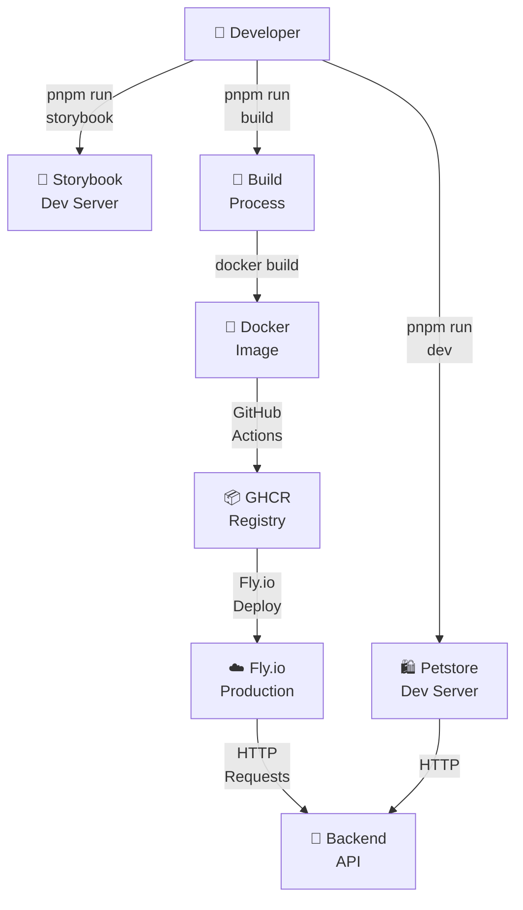
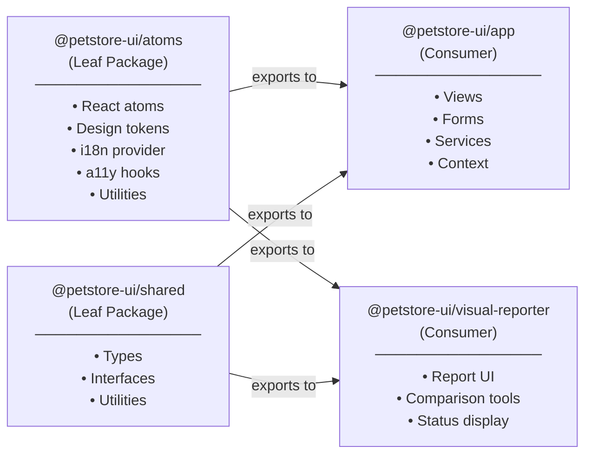
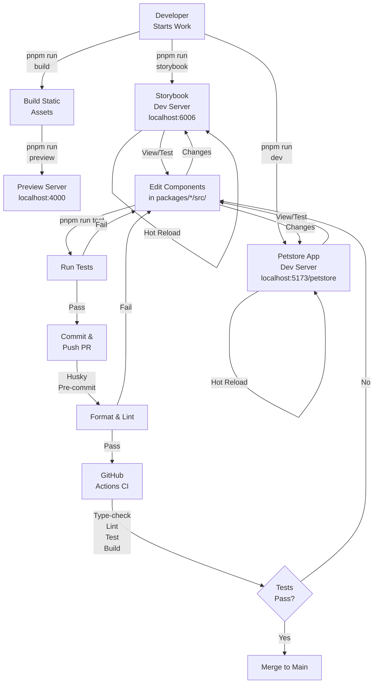
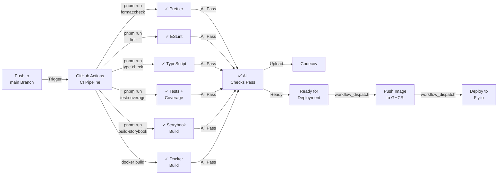

# Architecture

This document describes the architecture of petstore-ui, including the monorepo structure, package dependencies, and deployment flow.

## System Architecture



## Workspace Packages

The petstore-ui project is organized as a monorepo with four main packages:



### Package Responsibilities

| Package             | Location                    | Purpose                                     | Dependencies  |
| ------------------- | --------------------------- | ------------------------------------------- | ------------- |
| **atoms**           | `packages/atoms/`           | Reusable UI atoms, design system foundation | None (leaf)   |
| **shared**          | `packages/shared/`          | Shared types, interfaces, utilities         | None (leaf)   |
| **app**             | `packages/app/`             | Petstore demo application, views, forms     | atoms, shared |
| **visual-reporter** | `packages/visual-reporter/` | Visual regression report UI and tools       | atoms, shared |

### Entry Points

Each package exports from `packages/*/src/index.ts`:

```typescript
// packages/atoms/src/index.ts
export { Button, Badge, Input, ... } from './components/atoms/';
export { theme } from './tokens/theme';
export { useTranslation } from '../i18n/context';
export { useAccessibility } from '../accessibility/hooks';

// packages/shared/src/index.ts
export type { Pet, Order, ApiError, ... } from './types/';
export { formatDate, validateEmail, ... } from './utils/';

// packages/app/src/index.ts
export { PetstoreApp, useAppContext, ... } from './views/';
export { PetService, OrderService, ... } from './services/';

// packages/visual-reporter/src/index.ts
export { VisualReportApp, VisualStatusBadge, ... } from './components/';
```

## Development Workflow



## CI/CD Pipeline



## Deployment Flow

```mermaid
graph LR
    CODE["Source Code<br/>on GitHub"]

    CODE -->|Create<br/>release-ghcr/*<br/>branch| GIT_BRANCH["Git Branch"]
    GIT_BRANCH -->|Trigger| GHCR_WORKFLOW["GitHub Action:<br/>Create & Publish<br/>Docker Image"]

    GHCR_WORKFLOW -->|Build| DOCKER_IMG["Docker Image<br/>petstore-ui:latest<br/>petstore-ui:sha-xxx"]
    DOCKER_IMG -->|Push| GHCR["GitHub Container<br/>Registry<br/>ghcr.io/..."]

    GHCR -->|Manual<br/>workflow_dispatch| FLY_WORKFLOW["GitHub Action:<br/>Deploy to<br/>Fly.io"]

    FLY_WORKFLOW -->|Deploy| FLYIO_APP["Fly.io App<br/>petstore-ui-dev"]
    FLYIO_APP -->|Receives| TRAFFIC["HTTP Traffic"]

    TRAFFIC -->|Same-origin| API_PROXY["/api/v1<br/>Proxy"]
    API_PROXY -->|Upstream| BACKEND["Petstore<br/>Backend API"]
```



## Technology Stack

| Layer               | Technology             | Version | Purpose                             |
| ------------------- | ---------------------- | ------- | ----------------------------------- |
| **Runtime**         | Node.js                | ≥ 24    | Execution environment               |
| **Package Manager** | pnpm                   | ≥ 11    | Dependency and workspace management |
| **Framework**       | React                  | 18.3.1  | UI library                          |
| **Language**        | TypeScript             | 5.9.3   | Type-safe development               |
| **Build Tool**      | Vite                   | 6.4.2   | Fast bundling and dev server        |
| **Component Docs**  | Storybook              | 10.4.0  | Interactive component documentation |
| **Testing**         | Vitest                 | 3.2.4   | Unit test framework                 |
| **Test Utilities**  | @testing-library/react | 16.3.2  | React component testing             |
| **DOM Environment** | happy-dom              | 14.12.3 | Lightweight DOM for testing         |
| **Linting**         | ESLint                 | 8.57.1  | Code quality                        |
| **Formatting**      | Prettier               | 3.8.3   | Code formatting                     |
| **Pre-commit**      | Husky                  | 9.1.7   | Git hooks                           |
| **E2E Testing**     | Playwright             | 1.60.0  | Visual regression testing           |
| **Container**       | Docker                 | Latest  | Production deployment               |
| **Hosting**         | Fly.io                 | -       | Cloud deployment platform           |

## Design System (Tokens)

All components reference design system tokens from `packages/atoms/src/tokens/theme.ts`:

```typescript
export const theme = {
  colors: {
    primary: { 50: '#f0f9ff', 500: '#3b82f6', 900: '#1e3a8a' },
    semantic: { success: '#10b981', warning: '#f59e0b', error: '#ef4444' },
  },
  typography: {
    fontFamily: { sans: ['Inter', 'system-ui'], mono: ['JetBrains Mono'] },
    fontSize: { xs: '0.75rem', sm: '0.875rem', base: '1rem', ... },
  },
  spacing: { xs: '0.25rem', sm: '0.5rem', md: '1rem', lg: '1.5rem', xl: '2rem' },
  breakpoints: { sm: '640px', md: '768px', lg: '1024px', xl: '1280px' },
};
```

**Rule:** All components must use these tokens. No hardcoded colors, spacing, or font sizes.

## Internationalization (i18n)

The project supports multiple locales via `packages/atoms/src/i18n/`:

- **en** — English (production)
- **chef** — Swedish Chef pseudo-locale (text expansion testing)

**Usage in components:**

```typescript
const { t } = useTranslation();
const label = t('components.button.primary', { param: value });
```

**Translation files:** `packages/atoms/src/i18n/locales/{locale}.ts`

## Accessibility (a11y)

All components must meet WCAG 2.1 AA compliance via `packages/atoms/src/accessibility/`:

- **Keyboard navigation** — Tab, Enter, Space support
- **ARIA attributes** — Semantic labels and roles
- **Screen readers** — Announcements for state changes
- **Focus management** — Visible focus indicators
- **Contrast** — Minimum 4.5:1 ratio for text

**Usage in components:**

```typescript
const { ariaAttributes, handleKeyDown, announceAction } = useAccessibility({
  enterActivation: true,
  spaceActivation: true,
  announceOnAction: 'Action completed',
});
```

## State Management

The project uses **React Context** for app-level state (no Redux/Zustand):

- **Locale context** — Global locale provider (`packages/atoms/src/i18n/context.tsx`)
- **App context** — Application state (in `packages/app/src/context/`)
- **Local state** — `useState` within components

**Pattern:** Context provides values, custom hooks expose selectors:

```typescript
export function useAppContext() { ... }
export function usePetList() { ... }
```

## API Integration

The `packages/app/src/services/` layer handles all API communication:

```typescript
// packages/app/src/services/apiClient.ts
export class ApiClient {
  constructor(baseUrl: string) { ... }
  async get<T>(endpoint: string): Promise<T> { ... }
  async post<T>(endpoint: string, data: unknown): Promise<T> { ... }
}

// packages/app/src/services/petService.ts
export class PetService {
  constructor(private client: ApiClient) { ... }
  async getPets(): Promise<Pet[]> { ... }
  async getPetById(id: string): Promise<Pet> { ... }
}
```

**Configuration:** API base URL resolved from runtime config, meta tag, or environment:

```typescript
// Resolution order:
1. window.__RUNTIME_CONFIG__.API_BASE_URL (from /config.js)
2. <meta name="api-base-url" content="..." />
3. Error: API_BASE_URL not configured
```

See [Configuration](./configuration.md) for details.

## Testing Architecture

Tests are organized by layer:

| Layer      | Location                | Runner     | Tools                          |
| ---------- | ----------------------- | ---------- | ------------------------------ |
| **Unit**   | `**/*.test.ts(x)`       | Vitest     | Testing Library, happy-dom     |
| **Visual** | Playwright E2E          | Playwright | Visual regression + image diff |
| **i18n**   | i18n-utils test helpers | Vitest     | Testing across locales         |
| **a11y**   | a11y-utils test helpers | Vitest     | Accessibility validation       |

See [Testing](./testing.md) for comprehensive test patterns.

## Docker & Deployment

The `Dockerfile` builds a production image with:

1. **Build stage** — Compile TypeScript, bundle assets, run tests
2. **Runtime stage** — Nginx server, runtime config injection, environment setup

**Runtime config injection** via `docker/entrypoint.sh`:

- Reads environment variables (`API_BASE_URL`, `API_KEY`, `VERSION`, etc.)
- Generates `/config.js` with configuration object
- Sets nginx proxy rules and security headers

See [Deployment](./deployment.md) for complete Docker and Fly.io setup.

## File Organization Convention

```
packages/{package}/
├── src/
│   ├── components/
│   │   ├── atoms/           # Single-responsibility components
│   │   │   ├── Button.tsx
│   │   │   ├── Button.stories.tsx
│   │   │   ├── Button.test.tsx
│   │   │   └── types.ts      # Button-specific types (if needed)
│   │   ├── molecules/        # Composed from atoms
│   │   └── organisms/        # Complex compositions
│   ├── services/             # API integration
│   ├── context/              # React Context providers
│   ├── hooks/                # Custom React hooks
│   ├── utils/                # Utility functions
│   ├── types/                # TypeScript interfaces (shared)
│   ├── tokens/               # Design system tokens
│   ├── i18n/                 # Internationalization
│   ├── accessibility/        # a11y utilities and hooks
│   ├── testing/              # Test helpers and utilities
│   └── index.ts              # Package entry point
├── package.json
├── tsconfig.json
└── vitest.config.ts
```

## Next Steps

- **See [Getting Started](./getting_started.md)** to set up your development environment
- **See [Configuration](./configuration.md)** to understand runtime and environment setup
- **See [Testing](./testing.md)** for test patterns and strategies
- **See [Deployment](./deployment.md)** for Docker and Fly.io deployment

---

**Questions?** See [CONTRIBUTING.md](CONTRIBUTING.md) for contribution guidelines and component standards.
