# Deployment

This document describes how to deploy petstore-ui to production using Docker and Fly.io.

## Deployment Architecture

```mermaid
graph LR
    CODE["Source Code<br/>on GitHub<br/>main branch"]

    CODE -->|Create branch<br/>release-ghcr/*| GIT["Git Branch<br/>with version tag"]

    GIT -->|Trigger<br/>workflow| GHCR_WF["Workflow:<br/>Create & Publish<br/>Docker Image"]

    GHCR_WF -->|Build image<br/>multi-stage| DOCKER["Docker<br/>Image<br/>Build"]

    DOCKER -->|Push to<br/>registry| GHCR["GitHub<br/>Container Registry<br/>ghcr.io/<br/>ramonalcantaraarceo/<br/>petstore-ui"]

    GHCR -->|workflow_dispatch<br/>manual trigger| FLY_WF["Workflow:<br/>Deploy to<br/>Fly.io"]

    FLY_WF -->|flyctl deploy| FLYIO["Fly.io<br/>Production App<br/>petstore-ui-dev"]

    FLYIO -->|Listens on<br/>port 80| NGINX["Nginx<br/>Reverse Proxy"]

    NGINX -->|Serve<br/>static assets| STORYBOOK["Storybook<br/>localhost:6006"]

    NGINX -->|Proxy to<br/>API_PROXY_TARGET| API["Petstore<br/>Backend API"]
```



## Local Docker Setup

### Quick Start

Build and run the Docker image locally:

```bash
# Build image
docker build \
  --build-arg VERSION=local \
  --build-arg GIT_SHA=dev \
  --build-arg BUILD_DATE="$(date -u +'%Y-%m-%dT%H:%M:%SZ')" \
  -t petstore-ui .

# Run container
docker run -p 8080:80 \
  -e API_BASE_URL=/api/v1 \
  -e API_PROXY_TARGET=https://petstore-api-dev.ramon-alcantara.work \
  petstore-ui
```

Open http://localhost:8080 in your browser.

### Docker Compose

For a more complete local setup with environment variables:

```bash
# Create .env file
cat > .env << EOF
API_BASE_URL=/api/v1
API_PROXY_TARGET=https://petstore-api-dev.ramon-alcantara.work
VERSION=local
BUILD_DATE=$(date -u +'%Y-%m-%dT%H:%M:%SZ')
EOF

# Build and start
docker compose up --build
```

Open http://localhost:8080 in your browser.

**Container services:**

- Port 80: Nginx (Storybook + API proxy)
- Port 9090: (reserved for future health checks)

### Dockerfile Stages

The Dockerfile has two stages:

**Stage 1: Builder**

- Install dependencies
- Run TypeScript compilation
- Run linting and tests
- Build Storybook static assets
- Build Petstore app bundle

**Stage 2: Runtime**

- Copy built assets from builder
- Install Nginx
- Configure Nginx with proxy rules
- Copy entrypoint script
- Expose port 80

**Benefits:**

- Final image is smaller (only runtime dependencies)
- Build failures fail fast before creating large images
- Tests run in build process (fail if tests fail)

### Runtime Configuration Injection

The entrypoint script (`docker/entrypoint.sh`) runs at container startup:

1. Reads environment variables
2. Generates `/config.js` with runtime configuration
3. Configures Nginx API proxy rules
4. Optionally injects `API_KEY` header into proxied requests
5. Starts Nginx

**Generated `/config.js`:**

```javascript
window.__RUNTIME_CONFIG__ = {
  API_BASE_URL: '/api/v1',
  API_KEY: '<from environment>',
  VERSION: '1.0.0',
  GIT_SHA: 'abc1234',
  BUILD_DATE: '2026-05-28T10:00:00Z',
};
```

**Key insight:** `API_KEY` is never exposed to the browser. It's only used server-side by Nginx for proxied requests.

## GitHub Container Registry (GHCR)

### Pushing Images to GHCR

The workflow automatically publishes images when you push to a `release-ghcr/*` branch:

**Step 1: Create release branch**

```bash
git checkout -b release-ghcr/v1.0.0
```

**Step 2: Push to GitHub**

```bash
git push origin release-ghcr/v1.0.0
```

**Step 3: GitHub Actions**

- Workflow triggers automatically
- Builds Docker image
- Pushes to GHCR with two tags:
  - `ghcr.io/ramonalcantaraarceo/petstore-ui:latest`
  - `ghcr.io/ramonalcantaraarceo/petstore-ui:sha-<commit-short>`

**Step 4: Verify publication**
Go to [Packages](https://github.com/ramonalcantaraarceo/petstore-ui/pkgs/container/petstore-ui) to see published images.

### Image Metadata

Each published image includes build metadata:

```bash
docker inspect ghcr.io/ramonalcantaraarceo/petstore-ui:latest

# Example output:
# "Labels": {
#   "org.opencontainers.image.title": "petstore-ui",
#   "org.opencontainers.image.version": "1.0.0",
#   "org.opencontainers.image.revision": "abc1234",
#   "org.opencontainers.image.created": "2026-05-28T10:00:00Z"
# }
```

## Fly.io Deployment

### Prerequisites

1. **Fly.io account** — [Create account](https://fly.io)
2. **Flyctl CLI** — `brew install flyctl` or [install flyctl](https://fly.io/docs/getting-started/installing-flyctl/)
3. **Authentication** — `flyctl auth login`
4. **GitHub secret** — Set `FLY_API_TOKEN` in repository secrets

### First-Time Setup

The Fly.io deployment workflow creates the app if it doesn't exist:

```bash
flyctl auth login
flyctl apps list  # View existing apps
```

If `petstore-ui-dev` doesn't exist, the workflow will create it:

```yaml
- name: Create App and Set Secrets
  run: |
    if ! flyctl apps list | grep -q petstore-ui-dev; then
      flyctl apps create --name petstore-ui-dev --auto-confirm
    fi
    flyctl secrets set API_KEY=$API_KEY
```

### Deploying to Fly.io

**Step 1: Ensure image is published to GHCR**

Follow the GHCR steps above or trigger the build:

```bash
git push origin release-ghcr/v1.0.0
```

Wait for the publish workflow to complete.

**Step 2: Trigger deployment workflow**

Go to **Actions** → **Deploy to Fly.io Dev** → **Run workflow**

**Options:**

- **version:** Leave blank for `latest`, or specify `sha-<commit>` for rollback
- **Leave other fields as defaults**

**Step 3: Wait for deployment**

Workflow will:

1. Authenticate with Fly.io
2. Deploy image to `petstore-ui-dev` app
3. Wait for health checks to pass
4. Return app URL

**Step 4: Verify deployment**

```bash
# View deployment logs
flyctl logs --app petstore-ui-dev

# Test app
curl https://petstore-ui-dev.fly.dev
```

### Fly.io Configuration

App configuration is in `.fly/dev/fly.toml`:

```toml
app = "petstore-ui-dev"
primary_region = "iad"

[build]
  image = "ghcr.io/ramonalcantaraarceo/petstore-ui:latest"

[env]
  API_BASE_URL = "/api/v1"
  API_PROXY_TARGET = "https://petstore-api-dev.ramon-alcantara.work"

[http_service]
  internal_port = 80
  force_https = true

[checks]
  [checks.alive]
    type = "http"
    interval = "15s"
    timeout = "5s"
    grace_period = "30s"
    method = "GET"
    path = "/"
```

### Managing Fly.io Secrets

Store sensitive values as Fly.io secrets (not in `fly.toml`):

```bash
# Set secret
flyctl secrets set --app petstore-ui-dev API_KEY="your-token-here"

# View secrets (names only, not values)
flyctl secrets list --app petstore-ui-dev

# Remove secret
flyctl secrets unset --app petstore-ui-dev API_KEY
```

Secrets are available as environment variables inside the container.

### Scaling & Configuration

Adjust resources in `fly.toml`:

```toml
[vm]
  memory = "256mb"
  cpus = 1

[[services]]
  internal_port = 80
  protocol = "tcp"

  [services.concurrency]
    type = "requests"
    hard_limit = 1000
    soft_limit = 100
```

Apply changes:

```bash
flyctl deploy --app petstore-ui-dev
```

### Monitoring Deployment

View app status and metrics:

```bash
# Current status
flyctl status --app petstore-ui-dev

# Recent logs
flyctl logs --app petstore-ui-dev --lines 100

# Detailed metrics
flyctl metrics --app petstore-ui-dev
```

### Rollback to Previous Version

If deployment has issues, rollback to a previous image:

**Step 1: Get previous image tag**

```bash
docker images ghcr.io/ramonalcantaraarceo/petstore-ui
```

**Step 2: Trigger deploy workflow with previous tag**

Go to **Actions** → **Deploy to Fly.io Dev** → **Run workflow**

Enter **version:** `sha-<previous-commit>` (without `ghcr.io/...` prefix, just the tag)

This will deploy the previous image without rebuilding.

## CI/CD Workflows

### Continuous Integration

Triggered on every PR and push to main (`.github/workflows/ci.yml`):

```yaml
jobs:
  lint:
    runs-on: ubuntu-latest
    steps:
      - uses: actions/checkout@v4
      - uses: pnpm/action-setup@v2
      - uses: actions/setup-node@v4
        with:
          node-version: '24'
          cache: 'pnpm'
      - run: pnpm install
      - run: pnpm run format:check
      - run: pnpm run lint
      - run: pnpm run type-check

  test:
    runs-on: ubuntu-latest
    steps:
      - uses: actions/checkout@v4
      - uses: pnpm/action-setup@v2
      - uses: actions/setup-node@v4
      - run: pnpm install
      - run: pnpm run test:coverage
      - uses: codecov/codecov-action@v3
        with:
          token: ${{ secrets.CODECOV_TOKEN }}
```

**All must pass** before PR can be merged.

### Image Publishing

Triggered when pushing to `release-ghcr/*` branch (`.github/workflows/push-ghcr.yml`):

- Builds multi-stage Docker image
- Runs tests in build stage (fail fast)
- Pushes to GHCR with `latest` and `sha-<commit>` tags

### Deployment

Manual workflow in (`.github/workflows/deploy-fly-dev.yml`):

- Triggered via `workflow_dispatch` in Actions tab
- Deploys image from GHCR to Fly.io
- Can optionally specify version tag for rollback

## Environment-Specific Deployment

The project has multiple deployment environments:

### Development (`.fly/dev/fly.toml`)

- App name: `petstore-ui-dev`
- Memory: 256MB
- Backend: `https://petstore-api-dev.ramon-alcantara.work`
- Public: Yes

### Staging (`.fly/staging/fly.toml`)

- App name: `petstore-ui-staging`
- Memory: 512MB
- Backend: `https://petstore-api-staging.ramon-alcantara.work`
- Public: Yes

### Production (`.fly/production/fly.toml`)

- App name: `petstore-ui`
- Memory: 1GB
- Backend: `https://petstore-api.ramon-alcantara.work`
- Public: Yes

To deploy to different environments, update the workflow to use the correct config:

```bash
flyctl deploy --config .fly/staging/fly.toml
```

## Pre-Deployment Checklist

Before deploying, verify:

- [ ] Image builds locally without errors: `docker build .`
- [ ] Tests pass: `pnpm run test`
- [ ] TypeScript compiles: `pnpm run type-check`
- [ ] Linting passes: `pnpm run lint`
- [ ] Storybook builds: `pnpm run build-storybook`
- [ ] Image published to GHCR
- [ ] Deployment workflow shows "success"
- [ ] App responds to health checks: `curl https://petstore-ui-dev.fly.dev`
- [ ] API proxy is working: `curl https://petstore-ui-dev.fly.dev/api/v1/...`

## Health Checks

Fly.io continuously monitors app health with health checks defined in `fly.toml`:

```toml
[checks]
  [checks.alive]
    type = "http"
    interval = "15s"
    timeout = "5s"
    grace_period = "30s"
    method = "GET"
    path = "/"
```

**Health check details:**

- **Frequency:** Every 15 seconds
- **Timeout:** 5 seconds max
- **Grace period:** 30 seconds before first check
- **Path:** `/` (homepage)
- **Expected:** HTTP 200 response

If app fails health checks, Fly.io restarts the instance.

## Troubleshooting

### Build fails: "Module not found"

```bash
# Verify dependencies locally
pnpm install

# Check for TypeScript errors
pnpm run type-check

# Verify workspace configuration
cat pnpm-workspace.yaml
```

### Deployment fails: "Docker build failed"

```bash
# Test build locally
docker build . --progress=plain

# Check Dockerfile for issues
cat Dockerfile
```

### App crashes on startup

```bash
# View logs
flyctl logs --app petstore-ui-dev

# Check entrypoint script
cat docker/entrypoint.sh

# Verify environment variables
flyctl secrets list --app petstore-ui-dev
```

### Health checks failing

```bash
# Test health endpoint locally
curl -i http://localhost:8080/

# View health check logs
flyctl logs --app petstore-ui-dev | grep health
```

### API proxy not working

```bash
# Test backend connectivity
curl -i https://petstore-api-dev.ramon-alcantara.work/api/v1/pet

# Check Nginx configuration
flyctl ssh console -a petstore-ui-dev
# Then: cat /etc/nginx/nginx.conf
```

## Deployment Strategy

### Safe Deployment Process

1. **Create feature branch** — `git checkout -b feature/my-feature`
2. **Make changes** — Update components, tests, etc.
3. **PR and merge** — All CI checks must pass
4. **Tag release** — Create git tag with semantic version
5. **Push release branch** — `git push origin release-ghcr/v1.0.0`
6. **Wait for publish** — Image builds and publishes to GHCR (5-10 minutes)
7. **Manual deployment** — Trigger deploy workflow in Actions tab
8. **Verify** — Check logs and test deployed app
9. **Monitor** — Watch metrics for 24 hours

### Rollback Process

If deployment has issues:

1. Go to **Actions** → **Deploy to Fly.io Dev**
2. Click **Run workflow**
3. Enter previous `sha-xxx` tag in version field
4. Workflow redeploys previous image (no rebuild)
5. Verify app is stable

## Next Steps

- **See [Getting Started](./getting_started.md)** for local development
- **See [Configuration](./configuration.md)** for environment variables
- **See [Architecture](./architecture.md)** for deployment architecture diagrams

---

**Have questions?** Check the [Fly.io docs](https://fly.io/docs/) or create a GitHub issue.
