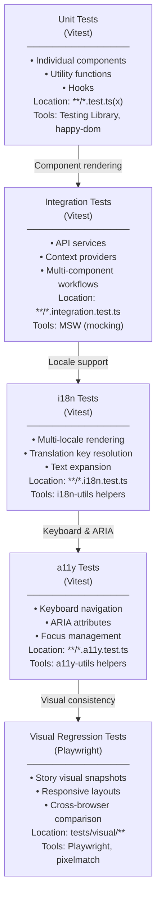

# Testing

This document describes the testing strategy, test organization, and how to write effective tests for petstore-ui.

## Testing Layers

Tests are organized into multiple layers, each with specific responsibilities:



## Unit Tests

### Structure

Unit tests follow this pattern:

```typescript
import { render, screen } from '@testing-library/react';
import { Button } from './Button';

describe('Button', () => {
  describe('Rendering', () => {
    it('renders without error', () => {
      render(<Button>Click me</Button>);
      expect(screen.getByRole('button')).toBeInTheDocument();
    });

    it('applies correct variant class', () => {
      render(<Button variant="primary">Primary</Button>);
      expect(screen.getByRole('button')).toHaveClass('btn--primary');
    });
  });

  describe('Interactions', () => {
    it('calls onClick handler', () => {
      const handleClick = jest.fn();
      render(<Button onClick={handleClick}>Click</Button>);
      fireEvent.click(screen.getByRole('button'));
      expect(handleClick).toHaveBeenCalledTimes(1);
    });

    it('does not call onClick when disabled', () => {
      const handleClick = jest.fn();
      render(<Button disabled onClick={handleClick}>Click</Button>);
      fireEvent.click(screen.getByRole('button'));
      expect(handleClick).not.toHaveBeenCalled();
    });
  });
});
```

### Test Organization

Each component gets a `ComponentName.test.tsx` file in the same directory:

```
packages/atoms/src/components/atoms/
├── Button.tsx
├── Button.stories.tsx
├── Button.test.tsx        ← Test file
└── types.ts
```

### Coverage Target

- **Minimum:** 80% line coverage across all packages
- **Ideal:** 90%+ for critical paths
- **Exception:** Stories (`.stories.tsx`) are exempt from coverage targets

Coverage reports are generated after each test run:

```bash
pnpm run test:coverage
```

Reports are written to `./coverage/` and uploaded to Codecov on CI.

## Integration Tests

Integration tests verify API service layers and context providers:

```typescript
import { ApiClient } from './apiClient';
import { server } from '../mocks/server';
import { HttpResponse, http } from 'msw';

describe('ApiClient', () => {
  beforeAll(() => server.listen());
  afterEach(() => server.resetHandlers());
  afterAll(() => server.close());

  it('fetches pet data', async () => {
    server.use(
      http.get('*/api/v1/pet/1', () => {
        return HttpResponse.json({ id: '1', name: 'Fluffy' });
      }),
    );

    const client = new ApiClient('/api/v1');
    const pet = await client.get('/pet/1');
    expect(pet).toEqual({ id: '1', name: 'Fluffy' });
  });

  it('handles API errors', async () => {
    server.use(
      http.get('*/api/v1/pet/999', () => {
        return HttpResponse.json({ error: 'Not found' }, { status: 404 });
      }),
    );

    const client = new ApiClient('/api/v1');
    await expect(client.get('/pet/999')).rejects.toThrow('404');
  });
});
```

**MSW Setup:** Mock Service Workers are configured in `test-setup.ts` and `packages/app/src/mocks/server.ts`.

## Internationalization Tests

Use `renderWithLocale` helper to test multi-locale rendering:

```typescript
import { renderWithLocale } from '../../testing/i18n-utils';

describe('Button - i18n', () => {
  it('renders translated content', () => {
    const { container } = renderWithLocale(
      <Button labelTranslationKey="components.button.primary" />,
      { locale: 'en' }
    );
    expect(screen.getByRole('button')).toHaveTextContent('Primary');
  });

  it('handles text expansion in longer locales', () => {
    const { container } = renderWithLocale(
      <Button labelTranslationKey="components.button.primary" />,
      { locale: 'chef' }  // Swedish Chef (longer text)
    );
    // Verify button doesn't truncate or overflow
    const button = screen.getByRole('button');
    expect(button.offsetHeight).toBeGreaterThan(0);
  });

  it('works across all supported locales', () => {
    const locales = ['en', 'chef'];
    locales.forEach(locale => {
      const { container } = renderWithLocale(
        <Button labelTranslationKey="components.button.primary" />,
        { locale }
      );
      expect(screen.getByRole('button')).toBeInTheDocument();
    });
  });
});
```

**Helper:** `packages/atoms/src/testing/i18n-utils.tsx`

## Accessibility Tests

Use `testKeyboardNavigation` and `auditAccessibility` helpers:

```typescript
import {
  testKeyboardNavigation,
  auditAccessibility,
} from '../../testing/a11y-utils';

describe('Button - a11y', () => {
  it('supports keyboard activation', async () => {
    const handleClick = jest.fn();
    render(
      <Button onClick={handleClick} enterActivation spaceActivation>
        Click me
      </Button>
    );

    await testKeyboardNavigation({
      element: screen.getByRole('button'),
      keys: ['{Enter}', ' '], // Test Enter and Space
      onTrigger: handleClick,
    });

    expect(handleClick).toHaveBeenCalledTimes(2);
  });

  it('has proper ARIA attributes', () => {
    render(
      <Button
        labelTranslationKey="components.button.primary"
        announceOnAction="Button activated"
      >
        Primary
      </Button>
    );

    const button = screen.getByRole('button');
    expect(button).toHaveAttribute('aria-label');
  });

  it('meets WCAG 2.1 AA compliance', async () => {
    render(<Button>Accessible Button</Button>);
    const audit = await auditAccessibility(screen.getByRole('button'));

    expect(audit.isCompliant).toBe(true);
    expect(audit.violations).toHaveLength(0);
  });

  it('has visible focus indicator', () => {
    render(<Button>Focus Test</Button>);
    const button = screen.getByRole('button');

    userEvent.tab();
    expect(button).toHaveFocus();

    const focusStyle = window.getComputedStyle(button, ':focus');
    expect(focusStyle.outline).toBeTruthy();
  });
});
```

**Helpers:** `packages/atoms/src/testing/a11y-utils.ts`

## Running Tests

### All Tests

```bash
# Run all tests once
pnpm run test

# Run tests in watch mode
pnpm run test -- --watch

# Run with coverage report
pnpm run test:coverage

# Run tests with UI
pnpm run test -- --ui
```

### Specific Package

```bash
# Test only atoms package
pnpm -F @petstore-ui/atoms run test

# Test only app package
pnpm -F @petstore-ui/app run test

# Test only visual-reporter package
pnpm -F @petstore-ui/visual-reporter run test
```

### Single File

```bash
# Test a specific file
pnpm run test -- packages/atoms/src/components/Button.test.tsx

# Test matching pattern
pnpm run test -- Button
```

### Test Filtering

```bash
# Run only specific test suite
pnpm run test -- --grep "Button.*Rendering"

# Skip specific tests
pnpm run test -- --grep "!slow"
```

## Visual Regression Testing

Visual regression tests compare component screenshots across builds using Playwright:

### Running Visual Tests

```bash
# Build Storybook and run visual tests
pnpm run test:visual

# Generate visual diff report
pnpm run report:visual

# Test only atoms stories
pnpm run test:visual:atoms

# Test only petstore app stories
pnpm run test:visual:petstore

# Update visual snapshots
pnpm run test:visual:update
```

### How Visual Tests Work

1. **Build Storybook** — Generates static stories with `pnpm run build-storybook`
2. **Playwright runs** — Opens each story in a browser and captures screenshots
3. **Pixel comparison** — Compares new screenshots against baselines
4. **Report generation** — Creates visual diff report in `public/visual-report/`

**Configuration:** `playwright.config.ts` and `tests/visual/**`

### Viewing Visual Reports

After running `pnpm run report:visual`, open the report:

```bash
pnpm run preview
# Then navigate to http://localhost:4000/visual-report/
```

The report shows:

- Left panel: Component hierarchy (namespace → design level → component)
- Right panel: Story variants
- Desktop/Mobile rows with expected vs. actual slider
- Status indicators (passed/failed)

## Test Patterns

### Testing Hooks

```typescript
import { renderHook, act } from '@testing-library/react';
import { useCounter } from './useCounter';

describe('useCounter', () => {
  it('increments counter', () => {
    const { result } = renderHook(() => useCounter());

    act(() => {
      result.current.increment();
    });

    expect(result.current.count).toBe(1);
  });

  it('works with custom initial value', () => {
    const { result } = renderHook(() => useCounter(10));
    expect(result.current.count).toBe(10);
  });
});
```

### Testing Context

```typescript
import { renderWithContext } from '../../testing/context-utils';

describe('AppContext', () => {
  it('provides app state', () => {
    const { result } = renderHook(() => useAppContext(), {
      wrapper: ({ children }) => (
        <AppProvider>{children}</AppProvider>
      ),
    });

    expect(result.current.isLoading).toBe(false);
  });
});
```

### Testing Event Handlers

```typescript
import { userEvent } from '@testing-library/user-event';

describe('Form', () => {
  it('submits form data', async () => {
    const handleSubmit = jest.fn();
    const user = userEvent.setup();

    render(<Form onSubmit={handleSubmit} />);

    await user.type(screen.getByLabelText('Email'), 'test@example.com');
    await user.click(screen.getByRole('button', { name: /submit/i }));

    expect(handleSubmit).toHaveBeenCalledWith({
      email: 'test@example.com',
    });
  });
});
```

### Mocking Modules

```typescript
jest.mock('@petstore-ui/app/services/petService', () => ({
  PetService: {
    getPets: jest.fn().mockResolvedValue([
      { id: '1', name: 'Fluffy' },
    ]),
  },
}));

describe('PetList', () => {
  it('displays pets', async () => {
    render(<PetList />);
    expect(await screen.findByText('Fluffy')).toBeInTheDocument();
  });
});
```

## CI/CD Testing

Tests run automatically on every PR and push to main:

1. **Format check** — `pnpm run format:check`
2. **Lint** — `pnpm run lint`
3. **Type-check** — `pnpm run type-check`
4. **Unit + integration tests** — `pnpm run test:coverage`
5. **Storybook build** — `pnpm run build-storybook`
6. **Visual regression** — `pnpm run test:visual` (on main only)

**All must pass** before PR can be merged.

Coverage reports are uploaded to Codecov:

- Minimum 80% line coverage required
- Badge displays coverage status
- Review coverage changes per PR

## Test File Checklist

Before committing component tests, verify:

- [ ] Component renders without error
- [ ] Correct CSS classes applied for each variant
- [ ] Event handlers called on interaction
- [ ] Translated content renders via LocaleProvider
- [ ] Keyboard activation works (Enter/Space)
- [ ] ARIA attributes present
- [ ] Works in multiple locales (en, chef)
- [ ] Accessibility audit passes
- [ ] Tests grouped in `describe` blocks
- [ ] Descriptive test names ("should...", "renders...")
- [ ] No console errors or warnings

## Debugging Tests

### View Test UI

```bash
pnpm run test -- --ui
```

Opens interactive test runner showing:

- Test file explorer
- Individual test results
- Coverage visualization
- Real-time test execution

### Debug Single Test

```bash
pnpm run test -- --inspect-brk packages/atoms/src/components/Button.test.tsx
```

Then open `chrome://inspect` in Chrome DevTools.

### Print Component Output

```typescript
import { render, screen } from '@testing-library/react';
import { debug } from '@testing-library/react';

render(<Button>Click me</Button>);
debug(screen.getByRole('button')); // Prints rendered HTML
```

### Check Test Timing

```bash
pnpm run test -- --reporter=verbose
```

Shows which tests are slow (over 1000ms).

## Performance Tips

1. **Use `renderHook` for hooks**, not full component render
2. **Mock heavy dependencies** (API calls, large data)
3. **Use `setupFiles`** to run once (not per test)
4. **Avoid nested describe blocks** — flatten when possible
5. **Batch assertions** — group related expects together

## Next Steps

- **See [Getting Started](./getting_started.md)** to set up test environment
- **See [Architecture](./architecture.md)** for testing architecture overview
- **See [CONTRIBUTING.md](CONTRIBUTING.md)** for component test requirements

---

**Have questions?** Check test examples in `packages/atoms/src/components/atoms/*.test.tsx`
